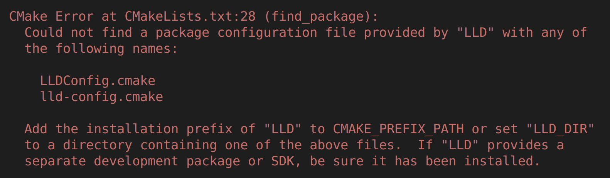
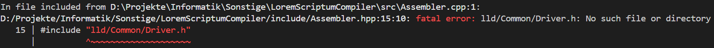
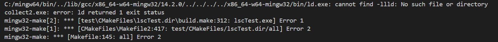

# Table of contents

- [Platforms](#platforms)
- [Get the source code](#get-the-source-code)
- [Dependencies](#dependencies)
    - [Windows dependencies](#windows-dependencies)
    - [Linux dependencies](#linux-dependencies)
- [Compiling](#compiling)
- [Known issues](#known-issues)
    - [Could not find a package configuration file provided by "LLD"](#could-not-find-a-package-configuration-file-provided-by-lld)
    - [No llvm/lld header files](#no-llvmlld-header-files)
    - [Cannot find -llld: No such file or directory](#cannot-find--llld-no-such-file-or-directory)

# Platforms

You should be able to compile LoremScriptumCompiler successfully on the following platforms:
- Windows 11 + MinGW
- Linux Ubuntu/Arch + GNU

# Get the source code

You can get the source code by downloading a LoremScriptumCompiler-v1.x-Source.zip

[https://github.com/vbielov/LoremScriptumCompiler/releases](https://github.com/vbielov/LoremScriptumCompiler/releases)

Or you can clone the repository using the following command:
```bash
git clone https://github.com/vbielov/LoremScriptumCompiler.git
cd LoremScriptumCompiler
```

# Dependencies

- GCC C++20 Compiler
- CMake
- LLVM, LLD
- We strongly recommend using Visual Studio Code as IDE  

## Windows dependencies

- MinGW (includes LLVM & LLD)

You will need to download from [https://winlibs.com/](https://winlibs.com/) the following package: 

`GCC x.x.x (with POSIX threads) + LLVM/Clang/LLD/LLDB x.x.x + MinGW-w64 x.x.x UCRT` for Win64

Unzip it somewhere, for example `C:\mingw64`. 

Now you will have to add `C:\mingw64\bin` to env. variables. 

Click the start button, then type "edit the system environment variables" into the search bar and hit Enter. In the System Properties window, click "Environment Variables."

You have to find the "Path" variable in "System variables". Select it and click "Edit"

Then click "New" and add `C:\mingw64\bin`. Click OK everywhere and close windows.

## Linux dependencies

You will need the following dependencies on Ubuntu:

```bash
sudo apt-get install -y g++ libc++-dev libc++abi-dev cmake clang llvm-dev libllvm llvm-tools lld liblld-dev libclang-dev zlib1g-dev libzstd-dev 
```

On Arch:

```bash
sudo pacman -S gcc libc++ cmake llvm lld lldb libclc polly clang
```
for more info about the LLVM toolchain on arch: https://wiki.archlinux.org/title/LLVM

# Compiling

[Get the source code](#get-the-source-code), open its directory and create a `build` directory. 

```bash
mkdir build
cd build
cmake ..    # On windows: cmake .. -G "MinGW Makefiles"
cmake --build . -j
```

When make finishes the compilation, you can find the executable inside `./build/lsc`.

# Known issues

## Could not find a package configuration file provided by "LLD"



it means your package manager doesn't have cmake configurations.

We solved it by getting them from [LLVM Releases](https://github.com/llvm/llvm-project/releases). Download `LLVM-x.x.x-Linux-X64.tar.xz` or `LLVM-x.x.x-Windows-X64.tar.xz`. And unzip it somewhere.

Now we have to tell cmake where those files are:

1. You can add `LLD_DIR` in `CMakeLists.txt` before `find_package(LLD REQUIRED CONFIG)`
    ```cmake
    set(LLD_DIR /path/to/llvm/lib/cmake/lld)
    ```

2. Or you can define it in the `cmake` command when configuring:
    ```bash
    cmake .. -DLLD_DIR="/path/to/llvm/lib/cmake/lld"
    ```

## No llvm/lld header files



We have seen this error only on Windows with MinGW and solved it again by getting header files from [LLVM Releases](https://github.com/llvm/llvm-project/releases). Download `LLVM-x.x.x-Windows-X64.tar.xz`.

Copy the following folders from `include` directory: `llvm`, `llvm-c`, `lld` to your `...\mingw64\include\`.

## Cannot find -llld: No such file or directory



This issue is also *windows only*. 

We have fixed it by going to the `...\mingw64\lib\cmake\lld\LLDConfig.cmake` file and **removing** `lld` from this line:

```cmake
set(LLD_EXPORTED_TARGETS "lldCommon;lld;lldCOFF;lldELF;lldMachO;lldMinGW;lldWasm")
```

