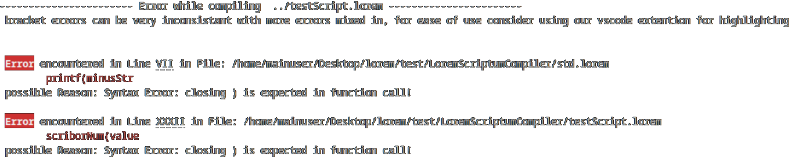

<h1 align="center">LoremScriptum Compiler</h1>
<p align="center">
    
    
    
</p>
<p align="center">
    
</p>

LoremScriptum is a new compiled programming language featuring Latin-inspired syntax and mathematical symbols. It uses LLVM to generate executable code for any Linux or Windows system.

> [!WARNING]
> This is just a student project for fun and education.
> Do not use it in production!

## Requirements

- GCC/Clang C++20 Compiler
- CMake, Make
- LLVM, LLD

If you are on Windows, I recommend using MinGW from [winlibs.com](https://winlibs.com/) and extracting it to `C:\mingw64\`

## Installation

To build and use the LoremScriptum compiler, follow these steps:

1. **Clone the repository:**

   ```bash
   git clone https://github.com/vbielov/LoremScriptumCompiler.git
   cd LoremScriptumCompiler
   ```

2. **Build the compiler:**

   ```bash
   mkdir build
   cd build
   cmake ..
   make
   ```

3. **Run the compiler:**

   ```bash
   ./lsc <input_file.lorem>
   ```

> [!TIP]
> For a better programming experience we **strongly** recommend using VS Code with the [LoremScriptum Extension](https://marketplace.visualstudio.com/items?itemName=BackBencher.loremscriptum)

## Our Compiler structure

The LoremScriptum compiler is divided into 4 main parts all of which are written in C++:

- **Lexer**: This part of the compiler reads the input file and converts it into a list of tokens.
- **Parser**: The parser reads the list of tokens and creates an Abstract Syntax Tree (AST).
- **Code Generator**: The code generator reads the AST and generates LLVM IR code.
- **LLVM**: Now LLVM takes over and generates the executable code. This will tremendously increase the speed and portability of the compiler.

## Custom Error Handling

The compiler uses a custom error handling system to provide detailed error messages to help the user understand what went wrong.  
You can also click on the line to jump directly to the error in your code.



## Language Syntax

Here is a short overview of the capabilities of LoremScriptum

```lorem
nihil printf = λ(litera[O] str)

litera[XIII] helloWorld = ['H','e','l','l','o',' ','W','o','r','l','d','!','\0']
printf(helloWorld)
```

```lorem
apere './std.lorem'

numerus var = III

var += II

si var ⇔ V:
    scriborNum(var)
;

numerus[IV] array = [O, I, II, III]

∑(numerus i = I, i < IV, i += I):
    numerus combinedValue = foo(array[i-I], array[i])
    scriborNum(combinedValue)
;

numerus foo = λ(numerus a, numerus b):
    retro a + b
;
```

### How to: Types

There are a total of **4** types in LoremScriptum:

| LoremScriptum | Equivalent | Example                |
| ------------- | ---------- | ---------------------- |
| numerus       | int        | O, XLII                |
| asertio       | boolean    | veri, falso            |
| litera        | char       | 'a', '\n'              |
| nihil         | void       | /                      |

> [!NOTE]  
> _nihil_ can only be used in function declarations.  
> numerus `O` is the equivalent to an arabic zero. The Roman number system does not atually include a symbol for zero.

You can also make an _array_ of any type by appending `[size]` to the type where `size` is a fixed numerus.

**Examples:**

```lorem
numerus[V] = [O, I, II, III, IV]
litera[V] = ['H', 'e', 'l', 'l', 'o']
```

### How to: Declarations

A declaration is always of the structure: `type identifier = expression`  
An identifier can be any combination of letters, numbers and underscores. but it must start with a letter or underscore.

**Examples:**

```lorem
numerus var = II + (IX + I) * IV
asertio isTrue = veri
litera letter = 'a'
```

You can also declare functions using the following syntax: `type identifier = λ(parameters): ... ;`

```lorem
numerus add = λ(numerus a, numerus b):
    retro a + b
;

numerus result = add(II, III)
```

> [!NOTE]
> The `retro` keyword is used to return a value from a function.  
> Code blocks can be opend with `:` and closed with `;`. This is the equivalent of `{` and `}` in other languages.

### How to: Flow Control

Flow control in LoremScriptum is done using the following keywords:

| LoremScriptum | Equivalent  |
| ------------- | ----------- |
| si            | if          |
| ni            | else        |
| nisi          | else if     |
| ∑             | while / for |

**Examples:**

```lorem
si a > b:
    ...
; nisi a < b:
    ...
; ni:
    ...
;
```

```lorem
∑():
    finio
;

∑(numerus i = O, i < V, i++):
    ...
;

∑(var < V, var++):
    ...
;

∑(var++):
    ...
;
```

> [!NOTE]
> If you want to escape the loop use the `finio` keyword. This is the equivalent of `break` in other languages.

### How to: Special Keywords & Operators

LoremScriptum uses multiple unique keywords and operators, most of which are difficult to type on a standard keyboard.

You can use the VS Code [LoremScriptum extension](https://marketplace.visualstudio.com/items?itemName=BackBencher.loremscriptum) and `CTRL + SHIFT + P` to open the command palette and search for  
`>LOREM toggle latex replace on save` to _automatically_ replace the keywords with their LoremScriptum equivalent.  
With this extension you can also have **syntax highlighting** for LoremScriptum.

The plugin will replace the following keywords:

| User Input | Plugin will replace with |
| ---------- | ------------------------ |
| `\lambda`  | `λ`                      |
| `\sum`     | `∑`                      |
| `==`       | `⇔`                      |
| `!=`       | `≠`                      |
| `>=`       | `≥`                      |
| `<=`       | `≤`                      |
| `*`        | `×`                      |
| `/`        | `÷`                      |
| `\neg`     | `¬`                      |
| `\and`     | `∧`                      |
| `\or`      | `∨`                      |

> [!NOTE]
> If you do not want to use the extension you can also copy the characters from the table above and paste them into your code.

### How to: Include other LoremScriptum files

You can include other LoremScriptum files using the `apere` keyword. This is the equivalent of `#include` in other languages.

The compiler will paste the content of the included file at the position of the `apere` keyword.

**Example:**

```lorem
apere './std.lorem'
apere './lib.a'
```
